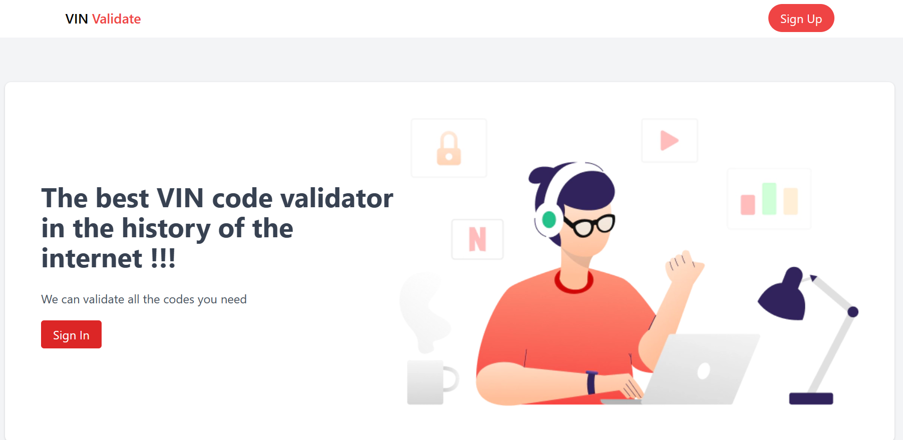

# VIN Decoder 
### Kata - Demonstrative project only



## Índice

- [Descripción](#descripción)
- [Instalación](#instalación)
- [Tecnologías Utilizadas](#tecnologías-utilizadas)
- [Rutas API](#rutas-api)
    - [Autenticación](#autenticación)
    - [Información VIN](#información-vin)
- [Configuración Postman para pruebas](#configuración-postman-para-pruebas)
- [Seguridad](#seguridad)
- [Contribuir](#contribuir)

## Descripción
El backend del Proyecto VIN Decoder está diseñado para facilitar la autenticación de usuarios y la recuperación de información de vehículos utilizando el Número de Identificación del Vehículo (VIN). Se conecta con APIs externas para verificar números de teléfono y decodificar información VIN.

## Instalación
Para configurar el entorno de desarrollo y producción con Laravel Sail, siga estos pasos:

### Prerrequisitos
Asegúrese de tener instalado:
- Git
- Docker Desktop
- Composer
- Node.js y npm

### Clonar el Repositorio
Clone el repositorio usando:
```bash
git clone https://github.com/Daespinosag/kata-vin-decoder.git
cd kata-vin-decoder
```

### Configurar Laravel Sail
Laravel Sail es una interfaz de línea de comandos para la gestión de su entorno de desarrollo Docker. Ejecute:
```bash
cp .env.example .env
docker run --rm \
    -u "$(id -u):$(id -g)" \
    -v $(pwd):/opt \
    -w /opt \
    laravelsail/php80-composer:latest \
    composer install --ignore-platform-reqs
./vendor/bin/sail up -d
./vendor/bin/sail artisan key:generate
./vendor/bin/sail artisan migrate
```

### Dependencias de Node
Instale las dependencias de Node.js y compile los assets con:
```bash
./vendor/bin/sail npm install
./vendor/bin/sail npm run dev # Para desarrollo
./vendor/bin/sail npm run prod # Para producción
```

Acceda a la aplicación en `http://localhost` después de que los contenedores estén en funcionamiento.

### Comandos Útiles de Sail
Detenga los contenedores con `./vendor/bin/sail down`, use `./vendor/bin/sail artisan` para comandos de Artisan y `./vendor/bin/sail shell` para una shell interactiva.

## Tecnologías Utilizadas
- Laravel 10.x
- Laravel Sanctum para autenticación basada en tokens
- Docker & Laravel Sail para el entorno de desarrollo
- MySQL como sistema de gestión de base de datos

## Rutas API

### Registro
```json
{
    "method": "POST",
    "url": "{url}/api/auth/register",
    "body": {
        "name": "nameExample",
        "email": "emailExample@example.com",
        "password": "passwordExample",
        "password_confirmation": "passwordExample",
        "phone": "phoneExample",
        "phone_code": "+codeExample"
    }
}
```

### Inicio de Sesión
```json
{
    "method": "POST",
    "url": "{url}/api/auth/login",
    "body": {
        "email": "emailExample@example.com",
        "password": "passwordExample"
    }
}
```

### Validar código SMS
```json
{
    "method": "POST",
    "url": "{url}/api/auth/validate-phone-code",
    "body": {
        "phone" : "examplePhone",
        "phone_code" : "+code",
        "code_verification" : "exampleCode"
    }
}
```

### Enviar código SMS
```json
{
    "method": "POST",
    "url": "{url}/api/auth/send-phone-code",
    "body": {
        "phone" : "examplePhone",
        "phone_code" : "+code"
    }
}
```

### Cierre de Sesión
```json
{
    "method": "POST",
    "url": "{url}/api/auth/logout",
    "header": {
      "Authorization": "Bearer {token}"
    }
}
```

### Validación de VIN
```json
{
    "method": "POST",
    "url": "{url}/api/vin/validate",
    "body": {
        "vin_code": "vinExample"
    },
    "header": {
        "Authorization": "Bearer {token}"
    }
}
```

## Seguridad
Este proyecto utiliza Laravel Sanctum para manejar la autenticación y protección de rutas. Es crucial seguir las mejores prácticas de seguridad para Laravel y APIs web en general, incluyendo la protección contra ataques de inyección SQL, XSS, y CSRF.

## Contribuir
Para contribuir al proyecto, por favor clone el repositorio, cree una rama para su característica o corrección y envíe un pull request para revisión.
